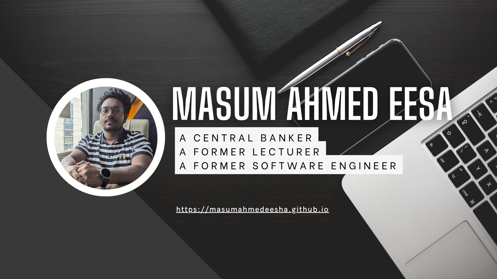
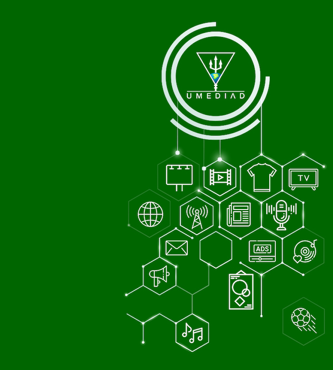
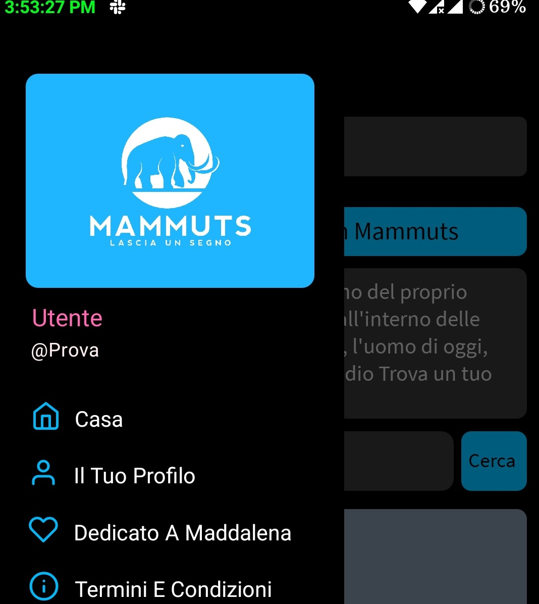
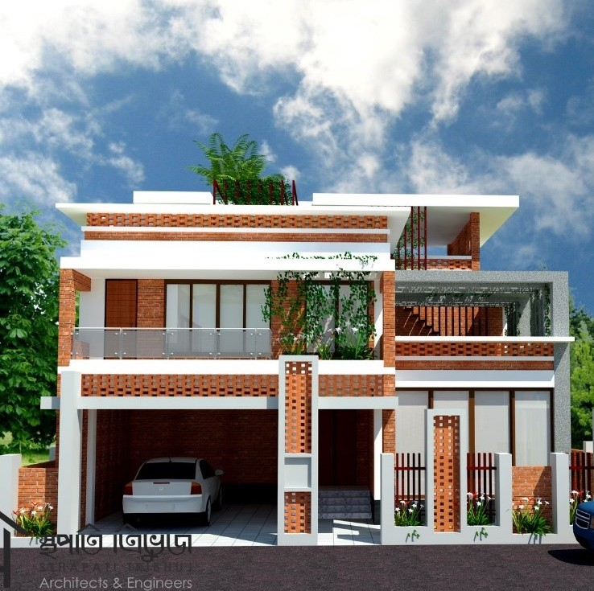
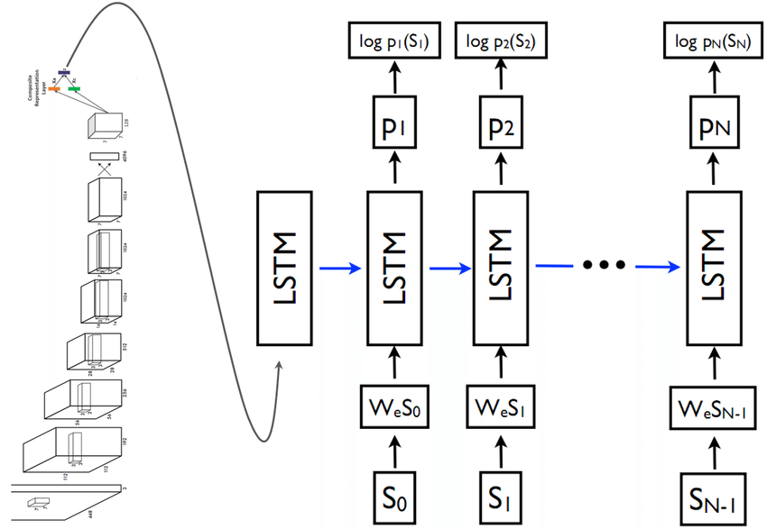

  

<h1>Hi, I am Masum Ahmed Eesa 👋</h1>

  <strong>Full Stack Developer · Open-source Builder · Former Lecturer · Data Engineer</strong>

  
  
  
  

  <a href="#-about-me">About</a>
  ·
  <a href="#-professional-journey">Journey</a>
  ·
  <a href="#-selected-projects">Projects</a>
  ·
  <a href="#-skills">Skills</a>
  ·
  <a href="#-research">Research</a>
  ·
  <a href="#-connect">Connect</a>

---

## 🌿 About Me

I am a Software Engineer interested in **frontier technologies, human-centered products, open-source systems, and community-minded software**.

My work spans full-stack product development, learning platforms, e-commerce systems, real-time communication, admin automation, API design, UI engineering, and machine learning experiments. I enjoy building products that are not only technically sound, but also clear, maintainable, and meaningful to the people who use them.

> [!NOTE]
> Feel free to explore my interactive 3D portfolio at [masumahmedeesa.github.io](https://masumahmedeesa.github.io), where my profile, projects, skills, research, and experience are presented as a living digital tree.

<table>
  <tr>
    <td align="center"><strong>50k+</strong> Users served</td>
    <td align="center"><strong>2k+</strong> LMS learners</td>
    <td align="center"><strong>30+</strong> REST APIs</td>
    <td align="center"><strong>350+</strong> Online judge solutions</td>
  </tr>
</table>

---

## 🧭 Professional Journey

### Full Stack Developer · CodexPro GmbH
**Part-time · Berlin, Germany · January 2023 - July 2025**

- Built scalable learning products and polished UI systems.
- Led development of an LMS serving 2,000+ learners.
- Integrated Vimeo Premium, PayPal, GeoLocation APIs, Webhooks, Mailgun, Mailchimp, and PushEngage.
- Built admin workflows for attendance, class video uploads, invoicing, vouchers, SmartCalendar, statistics, email, and notifications.
- Co-architected backend infrastructure for maintainability and scalability.

**Stack:** Next.js, Nest.js, Swagger, Puppeteer, Tailwind, Prisma, d3.js, Pandas, Docker, MongoDB, S3, CloudFront, DigitalOcean, Vercel

### Software Engineer · Daniyal Technologies
**Contract · Dhaka, Bangladesh · July 2023 - October 2023**

- Built and optimized e-commerce products serving 50,000+ users.
- Worked on Jars, Transaction Bee, Dispo, HYMAN, MacPharms, HGSHYDR, and LA Insurance.
- Developed scalable backend systems with NestJS, MongoDB, and MySQL.
- Integrated Puppeteer, UPS API, Nodemailer with Mailgun, Swagger, and NMI Payment Gateway.

**Stack:** Typescript, Next.js, Nest.js, Vue.js, Zustand, Tailwind, MongoDB, MySQL, DigitalOcean, Vercel

### Lecturer · Metropolitan University
**Full-time · Sylhet, Bangladesh · August 2021 - December 2022**

- Taught Basic Competitive Programming, Database Management Systems, Software Engineering, Web Engineering, Computer Graphics, and Operating Systems.
- Mentored students through hackathons, programming contests, and co-curricular activities.

### Junior Software Engineer · InnovexIT
**Part-time · Sylhet, Bangladesh · December 2020 - July 2021**

- Designed REST APIs and database architecture for Umediad, serving 5,000+ users.
- Implemented multilingual features, Stripe payments, Maps JavaScript API, Google Translate API, social login, and real-time chat with Socket.IO.

---

## 🧩 Selected Projects

<table>
  <tr>
    <td width="33%">
      
      <h3>CodexPro</h3>
      
Learning platform with LMS, analytics, custom UI systems, and automated admin workflows.

      
<strong>Next.js · Nest.js · MongoDB · AWS S3 · Vercel</strong>

    </td>
    <td width="33%">
      
      <h3>Umediad</h3>
      
Advertising marketplace with APIs, multilingual UX, payments, maps, and real-time chat.

      
<strong>React.js · Express.js · MongoDB · Socket.IO</strong>

    </td>
    <td width="33%">
      
      <h3>Mammuts</h3>
      
Social diary app for profiles, memories, photos, recordings, and private/public sharing.

      
<strong>React Native · Javascript · PHP</strong>

    </td>
  </tr>
  <tr>
    <td width="33%">
      
      <h3>aaloi</h3>
      
Consultancy hub and commodity supplier locator for civil and structural services.

      
<strong>Laravel · PHP</strong>

    </td>
    <td width="33%">
      
      <h3>Image Caption Generator</h3>
      
Machine learning experiment generating natural-language captions from image features.

      
<strong>Deep Learning · CNN · LSTM</strong>

    </td>
    <td width="33%">
      <h3>Open-source Direction</h3>
      
I enjoy building reusable systems, clear interfaces, and practical tools that other developers can adapt.

      
<strong>Documentation · DX · Community-minded engineering</strong>

    </td>
  </tr>
</table>

---

## 🛠 Skills

<table>
  <tr>
    <td width="50%">
      <h3>Languages</h3>
      
Javascript, Typescript, Python, C++, PHP

    </td>
    <td width="50%">
      <h3>Frameworks</h3>
      
React.js, Next.js, Express.js, Nest.js, React Native, Laravel

    </td>
  </tr>
  <tr>
    <td width="50%">
      <h3>Tools & Platforms</h3>
      
Git, MongoDB, MySQL, Docker, EC2, DigitalOcean, Vercel, Linux, MacOS, LaTeX

    </td>
    <td width="50%">
      <h3>Product Areas</h3>
      
LMS, admin panels, e-commerce, APIs, real-time systems, analytics, SEO, automation

    </td>
  </tr>
</table>

  
  
  
  
  
  
  

---

## 🔬 Research

### Linguistics Analysis of English ↔ Bangla Machine Translation

I analyzed English-Bangla parallel corpora using Statistical Machine Translation, Neural Machine Translation, and a neural lemmatizer to investigate translation errors and linguistic patterns.

**Focus:** Python, TensorFlow, SMT, NMT, Bangla NLP

### Image Caption Generator with CNN & LSTM

A deep learning project using image feature extraction and sequential language generation to produce captions from images.

**Focus:** Deep Learning, CNN, LSTM, computer vision, language generation

---

## 🎓 Education

**B.Sc. in Computer Science and Engineering**  
Shahjalal University of Science and Technology, Sylhet  
February 2017 to September 2021  
**CGPA:** 3.63 / 4.00

---

## 🤝 Connect

<table>
  <tr>
    <td><strong>Email</strong></td>
    <td><a href="mailto:masumahmedeesha@gmail.com">masumahmedeesha@gmail.com</a></td>
  </tr>
  <tr>
    <td><strong>GitHub</strong></td>
    <td><a href="https://github.com/masumahmedeesa">github.com/masumahmedeesa</a></td>
  </tr>
  <tr>
    <td><strong>LinkedIn</strong></td>
    <td><a href="https://www.linkedin.com/in/masumahmedeesa">linkedin.com/in/masumahmedeesa</a></td>
  </tr>
  <tr>
    <td><strong>Location</strong></td>
    <td>Motijheel C/A, Dhaka-1000</td>
  </tr>
</table>

---

  <strong>Building software that feels thoughtful, useful, and alive.</strong>

